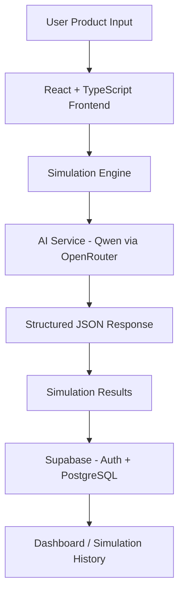

<div align="center">

# LaunchIQ.ai
### AI-Powered Product Launch Intelligence Platform

Predict product launch success **before going to market** using AI-powered strategic consulting intelligence.

**Live Platform:** https://launch-iq-ai.vercel.app/
**Product Demo:** https://drive.google.com/file/d/1_RsbBekWaEKZ1L8vRRmYzNKCSje6Rkrt/view?usp=drivesdk


</div>

---

## Overview

LaunchIQ.ai is an AI-powered product launch intelligence platform. Users describe
a product they're planning to launch (name, category, industry, audience, price,
region, features, competitors, and launch goal), and the platform generates a
structured, consulting-style analysis of its launch potential — before the product
ever goes to market.

Instead of relying on guesswork, LaunchIQ.ai produces:

- Purchase likelihood prediction
- Launch risk scoring
- Market sentiment analysis
- An executive strategic summary
- Strategic insights and market risks
- Pricing strategy recommendations
- Competitive positioning guidance
- Go-to-market strategy recommendations
- SWOT intelligence

Simulations are persisted per-user in Supabase, so past results can be revisited,
compared, and exported later.

## Key Features

| Feature | Description |
|---|---|
| Purchase Likelihood | Predicted customer adoption probability |
| Launch Risk Score | Estimated launch risk level |
| Market Sentiment | Predicted consumer reaction |
| Executive Summary | AI-generated consulting-style summary |
| Strategic Insights | Actionable, product-specific recommendations |
| Pricing Strategy | AI pricing guidance |
| Competitive Positioning | How to position against named competitors |
| Go-To-Market Strategy | AI-generated launch recommendations |
| SWOT Intelligence | Strengths, weaknesses, opportunities, threats |
| Simulation History | Saved, searchable, filterable past simulations |
| Report Export | Export simulation results (PDF) |

## High-Level Architecture

LaunchIQ.ai is a single-page React application. There is no custom backend
server — the frontend talks directly to two managed services:



- **Frontend** — React 19 + TypeScript + Vite, styled with Tailwind CSS and
  shadcn/ui, routed with React Router.
- **AI integration** — an OpenAI-compatible chat-completions call to
  [OpenRouter](https://openrouter.ai), using the `qwen/qwen3.6-27b` model, to
  turn a structured prompt into structured JSON launch intelligence.
- **Persistence & auth** — [Supabase](https://supabase.com) (Auth + Postgres)
  stores user accounts and simulation history.
- **Hosting** — Vercel.

See [`docs/architecture.md`](docs/architecture.md) for a more detailed breakdown
and [`docs/backend.md`](docs/backend.md) for how the "backend" services are
used from the frontend.

## Repository Structure

```text
LaunchIQ.ai/
├── frontend/                    # The React + TypeScript application (Vite)
│   ├── public/                  # Static assets served as-is (favicon, brand images)
│   └── src/
│       ├── ai/                  # AI integration: config, client, prompt, response parsing
│       ├── app/                 # App-level wiring: router, providers
│       ├── assets/              # Bundled assets (images) imported by components
│       ├── components/          # Reusable UI building blocks
│       │   ├── auth/            # Route guards (ProtectedRoute, PublicRoute)
│       │   ├── common/          # Generic shared components (logo, page header, ...)
│       │   ├── dashboard/       # Dashboard-specific components
│       │   ├── layout/          # Page shells (marketing layout, dashboard layout/sidebar)
│       │   ├── simulation-history/  # Components specific to the simulation history view
│       │   └── ui/              # shadcn/ui primitives (button, card, dialog, ...)
│       ├── config/               # Static app configuration (branding, navigation)
│       ├── context/              # React context providers (AuthContext)
│       ├── hooks/                 # Reusable React hooks
│       ├── lib/                    # Third-party client setup + generic helpers (Supabase client, cn())
│       ├── pages/                   # Route-level page components
│       ├── simulation/                # Simulation domain/business logic (engine, SWOT, status)
│       ├── types/                      # Shared TypeScript types
│       └── utils/                       # Generic utilities (filtering, report export)
├── docs/
│   ├── architecture.md          # Detailed system architecture
│   ├── backend.md                # How Supabase + the AI provider are used
│   └── product-foundation.md      # Product spec: users, inputs/outputs, scope
└── README.md                        # You are here
```

## AI Integration

The AI integration lives entirely under [`frontend/src/ai`](frontend/src/ai):

| File | Responsibility |
|---|---|
| `config.ts` | Reads the AI model, base URL, and API key from environment variables |
| `client.ts` | Configures a shared OpenAI-compatible client pointed at the provider |
| `prompts.ts` | Builds the launch-intelligence prompt from simulation input |
| `types.ts` | `SimulationInput` type, plus the `LaunchInsightsSchema` Zod schema (source of truth for `LaunchInsights`) |
| `parser.ts` | Cleans and parses the model's JSON response, validates it against `LaunchInsightsSchema` at runtime, and repairs common formatting mistakes before giving up |
| `generateLaunchInsights.ts` | Orchestrates prompt → API call → parse/validate, throws on failure |

`frontend/src/simulation/simulationEngine.ts` calls `generateLaunchInsights()` and
maps the result into the simulation result shape the rest of the app expects. If
the AI request or parsing fails, the failure reason is surfaced in the returned
`executiveSummary` rather than failing silently.

The integration talks to any OpenAI-compatible `/chat/completions` endpoint, so
the provider can be swapped by changing `VITE_AI_BASE_URL` and `VITE_AI_MODEL`
without code changes. By default it targets OpenRouter's `qwen/qwen3.6-27b`.

The AI response is untrusted external input, so it's validated at runtime with
[Zod](https://zod.dev) (`LaunchInsightsSchema` in `ai/types.ts`) rather than
trusted via TypeScript casts alone — numeric fields are range-checked and any
field the model omits or returns with the wrong type falls back to a safe
default instead of silently entering the UI.

## Getting Started

### Prerequisites

- Node.js 18+
- A [Supabase](https://supabase.com) project (URL + anon key)
- An [OpenRouter](https://openrouter.ai) API key (or any OpenAI-compatible
  provider that serves `qwen/qwen3.6-27b`)

### Setup

```bash
cd frontend
npm install
cp .env.example .env
# fill in .env with your Supabase and AI provider credentials
npm run dev
```

The app runs at `http://localhost:5173` by default.

### Environment Variables

Defined in [`frontend/.env.example`](frontend/.env.example):

| Variable | Required | Description |
|---|---|---|
| `VITE_SUPABASE_URL` | Yes | Your Supabase project URL |
| `VITE_SUPABASE_ANON_KEY` | Yes | Your Supabase anon/public API key |
| `VITE_AI_API_KEY` | Yes | API key for the AI provider (OpenRouter by default) |
| `VITE_AI_MODEL` | No | Model identifier (defaults to `qwen/qwen3.6-27b`) |
| `VITE_AI_BASE_URL` | No | OpenAI-compatible API base URL (defaults to OpenRouter) |

No API keys, secrets, or tokens are hard-coded anywhere in the codebase — all
credentials are read from environment variables at runtime.

### Available Scripts

Run from `frontend/`:

| Script | Purpose |
|---|---|
| `npm run dev` | Start the Vite dev server |
| `npm run build` | Type-check and build for production |
| `npm run lint` | Run ESLint |
| `npm run preview` | Preview the production build locally |

## Further Reading

- [`docs/architecture.md`](docs/architecture.md) — full system architecture
- [`docs/backend.md`](docs/backend.md) — Supabase + AI provider usage
- [`docs/product-foundation.md`](docs/product-foundation.md) — product scope, target users, supported industries
