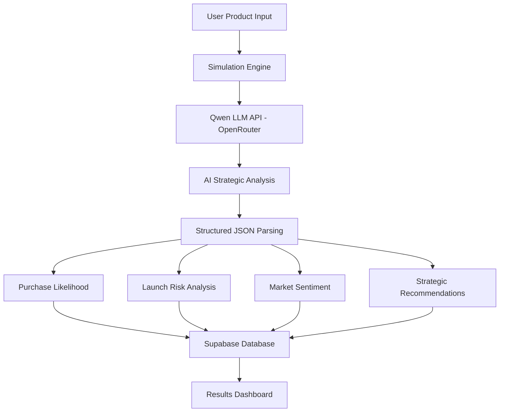

# LaunchIQ.ai Backend Architecture

> AI-powered backend intelligence powered by **Qwen LLM + Supabase + PostgreSQL**

**Live Platform:**  
https://launch-iq-ai.vercel.app/

**Deployment Status:** Deployed (portfolio/demo project)

> **Note:** LaunchIQ.ai does not run a custom backend server. "Backend" here
> refers to the managed services the frontend talks to directly: Supabase
> (auth + PostgreSQL) for persistence, and an OpenAI-compatible AI provider
> (OpenRouter, serving `qwen/qwen3.6-27b`) for launch-intelligence
> generation. Both are called from `frontend/src` — see
> [`frontend/src/ai`](../frontend/src/ai) and
> [`frontend/src/lib/supabase.ts`](../frontend/src/lib/supabase.ts).

---

# Core Backend Components

| Component | Technology | Purpose |
|------------|-------------|----------|
| Authentication | Supabase Auth | User login, signup & session management |
| Database | PostgreSQL | Simulation persistence & structured storage |
| AI Intelligence | Qwen (qwen/qwen3.6-27b via OpenRouter) | Strategic consulting intelligence |
| API Layer | TypeScript Services | AI orchestration & response handling |
| Storage | Supabase | Product simulation records |
| Hosting | Vercel | Production deployment |

---

# AI Intelligence Pipeline



---

# Backend Workflow

LaunchIQ.ai follows an **AI-powered strategic intelligence workflow**:

### Step 1 — Product Input Collection
Users provide:

- Product Name
- Category
- Industry
- Target Audience
- Pricing
- Product Features
- Competitors
- Market Region
- Launch Goals

### Step 2 — AI Processing
The simulation engine sends structured prompts to:

```txt
Qwen LLM (qwen/qwen3.6-27b)
```

to generate:

- Purchase likelihood
- Risk assessment
- Market sentiment
- Strategic recommendations
- Pricing insights
- Competitive positioning
- Go-To-Market strategy
- SWOT intelligence

### Step 3 — Structured Response Parsing
AI responses are parsed into structured JSON format for consistency and reliability.

### Step 4 — Database Persistence
Simulation results are securely stored in:

```txt
Supabase PostgreSQL
```

for dashboard retrieval and historical tracking.

### Step 5 — Dashboard Intelligence
Users receive:

- Executive strategic summary  
- Market risk insights  
- Competitive intelligence  
- Launch recommendations  
- AI-powered consulting outputs  

---

# Backend Technologies

```txt
Supabase Authentication
PostgreSQL Database
Qwen LLM API - OpenRouter
qwen/qwen3.6-27b
TypeScript Service Layer
Structured JSON Parsing
Environment Variable Security
Vercel Production Hosting
```

---

# Backend Status

```txt
Authentication Layer        Complete
Database Persistence        Complete
Qwen AI Integration         Complete
JSON Parsing Engine         Complete
Simulation Storage          Complete
Results Processing          Complete
Deployed (demo/portfolio)   Yes
Public Access               Live
```
